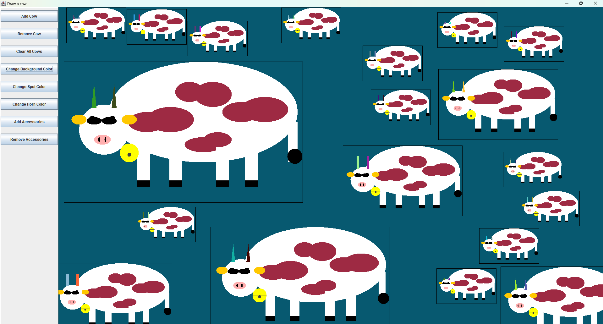

Software Construction (SO2) – Java Programming Laboratory Work

################################################
#  Author: Heshini Jayaweera                   #
#  Course: SO2 – Java Programming              #
#  University: HAW Hamburg                     #
################################################

Java GUI Cow Project

This project is a graphical Java application that displays a cow constructed from multiple components using Java Swing.
It demonstrates the use of GUI frameworks and object-oriented design to build a structured and interactive application.

---

 🎯 Features

* 🐄 Cow drawn using multiple graphical components
* 🧩 Modular design (different body parts as components)
* 🎨 Interactive buttons to change background color
* 🖼️ GUI built using Swing (`JFrame`, `JPanel`, etc.)

---

 🛠️ Technologies Used

* Java
* Java Swing (JFrame, JPanel, JButton)
* Eclipse IDE

---

 🧠 Key Concepts

* Object-Oriented Programming (OOP)
* GUI development in Java
* Event handling (button clicks)
* Component-based design
* Inheritance
* Design Patterns (ex: Decorator pattern)

---

 ▶️ How to Run

1. Open the project in Eclipse
2. Locate the main class (e.g., `Main.java`)
3. Run the application

---

 📂 Project Structure

* `Main.java` – Entry point of the program
* `Cow.java` – Main cow structure
* `Head.java`, `Body.java`, etc. – Individual components
* `DrawingTool.java` – Handles JFrame and panels

---

 🎮 Usage

* Launch the application
* Use buttons to:

  * Change background color
  * Interact with the GUI

---

 📸 Screenshot

 

---

 🎯 Purpose

This project was developed as part of the SO2 coursework to:

* Practice GUI programming in Java
* Understand component-based architecture
* Apply event-driven programming concepts

---

 👤 Author
🔗 [Patterned cattle](https://github.com/heshi-hub/SO2/tree/main/src/drawingTool)
